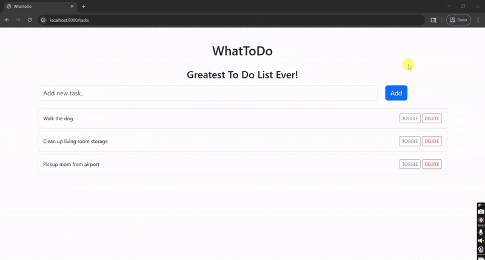

# WhatToDo — Spring Boot + Thymeleaf To‑Do App

A clean, production‑ready to‑do application built with **Spring Boot**, **Thymeleaf**, **MySQL** and **JPA**.

---

## Table of Contents

- [Features](#features)
- [Architecture](#architecture)
- [Tech Stack](#tech-stack)
- [Project Structure](#project-structure)
- [Data Model](#data-model)
- [Getting Started](#getting-started)
    - [Run Locally (MySQL)](#run-locally-mysql)
- [API](#api)
- [Screenshots](#screenshots)
- [Roadmap](#roadmap)

---

## Features

**Current UI**
- Create tasks from the landing page
- Toggle completion and delete tasks
- Bootstrap‑styled, responsive list

---

## Architecture

```
┌──────────────────────────────────────────────────────────────────┐
│                       WhatToDo (Monolith)                        │
├──────────────────────────────┬───────────────────────────────────┤
│ Web (UI)                     │ API                               │                
│ Thymeleaf                    │ Spring Web MVC                    │
├──────────────────────────────┴───────────────────────────────────┤
│ Service Layer                                                    │
├──────────────────────────────────────────────────────────────────┤
│ Persistence (Spring Data JPA)                                    │
│ DB: MySQL                                                        │
└──────────────────────────────────────────────────────────────────┘
```

---

## Tech Stack

- **Java 21**, 
- **Spring Boot 3**, 
- **Spring Data JPA**,
- **Thymeleaf**,
- **MySQL** 

---

## Project Structure

```text
src
├─ main
│  ├─ java/com/todo/WhatToDo
│  │  ├─ controller/ (Thymeleaf MVC)
│  │  ├─ model/ (JPA entities)
│  │  ├─ repository/ (Spring Data JPA repos)
│  │  ├─ service/ (business logic)
│  │  └─ WhatToDoApplication.java
│  └─ resources/
│     ├─ templates/ (Thymeleaf views)
│     ├─ static/ (images)
│     └─ application.properties
```

---

## Data Model

**Entities**
- `Task`: id, title, completed
**Example DDL (MySQL dialect)**

```sql
CREATE TABLE tasks (
  id BIGINT PRIMARY KEY AUTO_INCREMENT,
  title VARCHAR(255) NOT NULL,
  completed BOOLEAN NOT NULL DEFAULT FALSE,
);
```

---

## Getting Started

### Run Locally (MySQL)

**Prereqs:** Java 21, Maven 3.9+, MySQL 8

1) **Configure DB** (create a database):
```sql
CREATE DATABASE whattodo CHARACTER SET utf8mb4 COLLATE utf8mb4_0900_ai_ci;
```

2) **Configuration** — `src/main/resources/application.properties`
```properties
spring.datasource.url=jdbc:mysql://localhost:3306/whattodo
spring.datasource.username=YOUR_DB_USER
spring.datasource.password=YOUR_DB_PASS
spring.jpa.hibernate.ddl-auto=validate
spring.jpa.show-sql=false
spring.jpa.open-in-view=false

```

3) **Run**
```bash
mvn spring-boot:run
# or
mvn clean package -DskipTests && java -jar target/*.jar
```

## API ENDPOINTS

<summary><strong>Tasks</strong></summary>
     <ul>
        <li><code>POST /tasks</code>: Create new task. <code>Parameters</code>: id(Path), title(String)</li>
        <li><code>POST /tasks/{id}/update</code>: Updates title of an existing tag. <code>Parameters</code>: title(String, in request param)/</li>
        <li><code>GET /tasks</code>: Retrieves all tasks. <code>Parameters</code>: None</li>
        <li><code>GET /tasks/{id}/delete</code>: Deletes task by ID. <code>Parameters</code>: id(Path)</li>
        <li><code>GET /tasks/{id}/toggle</code>: Toggles completion status of a task. <code>Parameters</code>: id(Path)</li>
     </ul>

---

## Screenshots

| Walk Through                                                             |
|--------------------------------------------------------------------------|
|  |

---

## Roadmap

- [ ] Inline edit & draggable ordering
- [ ] Labels/tags & color coding
- [ ] Recurring tasks & reminders
- [ ] Calendar view + iCal export
- [ ] OAuth2 login (Google) demo
- [ ] WebSocket live updates
- [ ] Postgres support + query hints
- [ ] GraphQL endpoint 

---

